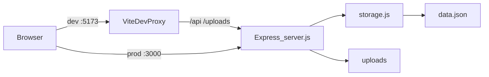
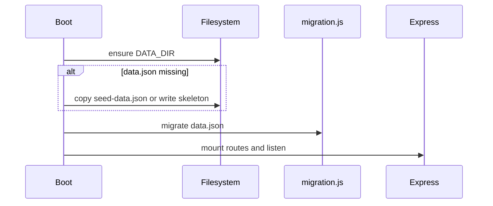
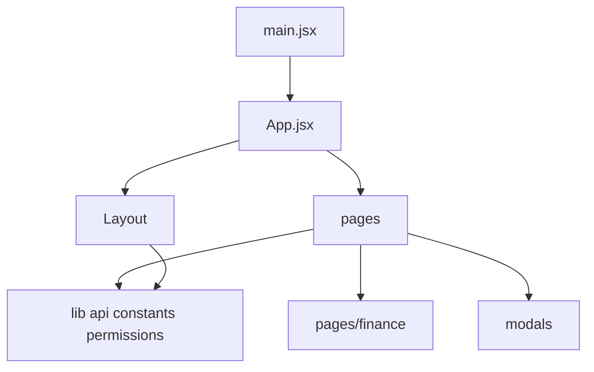

# Architecture

System design for the Robotics Inventory App. Companion docs: [README.md](README.md) (ops), [AGENTS.md](AGENTS.md) (edit index).

---

## Overview

A single Node process serves the REST API and (in production) the built React SPA. All application state lives in one JSON file under `DATA_DIR`, with uploads as sibling files. There is no external database or session store.

| Layer | Tech | Entry |
|-------|------|-------|
| UI | React 18, React Router 6, Tailwind, Chart.js | `frontend/src/main.jsx` → `App.jsx` |
| API | Express 4, cors, multer, uuid | `backend/server.js` |
| Persistence | Flat JSON + atomic write chain | `backend/utils/storage.js` |
| Schema evolution | Idempotent migrate on boot | `backend/utils/migration.js` |

---

## Boot sequence

`backend/server.js` runs this once before listening:

1. **`initializeAndMigrate()`**
   - Create `DATA_DIR` if missing.
   - If `data.json` is absent, copy `seed-data.json` from project root (or `backend/`), else write `{}`.
   - Call `migrate(DATA_FILE)` — always, idempotent.
2. **`startServer()`**
   - Middleware: CORS, JSON body (10mb), `X-User-Id` → `req.user`.
   - Mount route modules under `/api/*`.
   - Serve `/uploads` from `DATA_DIR/uploads`.
   - If `../public` exists, serve SPA + catch-all `index.html` (excluding `/api` and `/uploads`).
   - Listen on `process.env.PORT || 3001`.

---

## Auth model

Auth is intentionally simple (trusted LAN / team deploy):

| Step | Behavior |
|------|----------|
| Login | `POST /api/auth/login` with `{ name, password }` — plaintext compare against `rt:users` |
| Response | User object with `password` stripped |
| Client storage | `localStorage` key `rt_user` |
| Subsequent API calls | `frontend/src/lib/api.js` sets header `X-User-Id: <user.id>` |
| Server | Middleware loads user from `rt:users` by id into `req.user` |
| Route guards | Each router defines local `requireRole(...roles)` |
| UI gates | `hasPermission(user, key)` + `PermRoute` in `App.jsx`; nav filtered via `NAV_ITEMS[].permission` |

There are no JWTs, cookies, or server-side sessions. Knowing a user id is enough to act as that user if the client sends the header.

**Frontend vs backend permission models**

- Frontend: granular string keys (`inventory.view`, `finance.edit`, …) on `user.permissions`, with Admin bypass.
- Backend routes: mostly **role name** checks (`requireRole('Admin', 'Manager')`), not the granular keys.
- Role **default** permission arrays are duplicated in:
  - `frontend/src/lib/constants.js` → `ROLE_DEFAULT_PERMISSIONS`
  - `backend/utils/migration.js` → `ROLE_DEFAULT_PERMISSIONS`

Keep those lists in sync when changing roles or defaults.

---

## Storage

[`backend/utils/storage.js`](backend/utils/storage.js):

| Export | Behavior |
|--------|----------|
| `DATA_DIR` | `process.env.DATA_DIR` or `backend/data` |
| `readData()` | Sync read + parse; falls back to `data.json.bak` on parse failure |
| `writeData(data)` | Serialized promise chain; write `.tmp` → copy current to `.bak` → rename to `data.json` |
| `updateKey(key, fn)` | Read → mutate one top-level key → write |

All route handlers that mutate state typically `readData()`, change arrays in memory, then `writeData(data)`. Concurrent requests are serialized at the write layer; reads are not locked.

---

## Data model

Top-level keys in `data.json` (prefix `rt:`). Created by migration if missing:

| Key | Purpose |
|-----|---------|
| `rt:users` | Accounts: `id`, `name`, `password`, `role`, `permissions[]` |
| `rt:locs` | Location names |
| `rt:items` | Inventory items (see below) |
| `rt:units` | Per-unit records when item `totalQty` > 1 |
| `rt:purchases` | Purchase requests / orders |
| `rt:borrows` | Borrow / loan records |
| `rt:moveRequests` | Pending location moves |
| `rt:auditLog` | Undoable mutation audit entries |
| `rt:activityLog` | Human-readable activity feed |
| `rt:customFields` | Custom field definitions by category |
| `rt:accountingTransactions` | Ledger entries |
| `rt:budgets` | Budget lines |
| `rt:savingsGoals` | Savings goals + funding |
| `rt:reimbursements` | Reimbursement requests |
| `rt:fundraisers` | Fundraisers + donations |

### Item shape (normalized by migration)

Important fields on each `rt:items` record:

- Identity / catalog: `id`, `name`, `sku`, `category`, `notes`, `imageUrl`, `isKit`, `minStock`, `totalQty`, `createdAt`
- Placement: `currentLocation`, `currentPerson`, `locationLog[]`
- Condition: `condition`, `conditionLog[]`
- Stock history: `quantityLog[]`
- Attachments / social: `invoices[]`, `comments[]`
- Kit: `components[]`
- Extensibility: `customFields` object (values); definitions live in `rt:customFields`

Migration generates `rt:units` children when `totalQty > 1` and units do not already exist for that parent.

Legacy seed fields (`pin`, `isAdmin`, `isManager`) are converted on migrate: role derived from flags, `password` from `pin` or `'changeme'`.

---

## API surface

Mounted in [`backend/server.js`](backend/server.js):

| Mount | Module | Domain |
|-------|--------|--------|
| `POST /api/auth/login` | inline in `server.js` | Login |
| `/api/items` | `routes/items.js` | CRUD, stock, condition, moves, units, images, invoices, comments |
| `/api/move-requests` | `routes/moves.js` | List / approve / deny move requests |
| `/api/purchases` | `routes/purchases.js` | Purchase lifecycle; receive → may create inventory item |
| `/api/borrows` | `routes/borrows.js` | Borrow / return |
| `/api` | `routes/accounting.js` | Transactions, budgets, goals, reimbursements, fundraisers, reports, receipt upload |
| `/api/approvals` | `routes/approvals.js` | Aggregated pending moves + reimbursements |
| `/api` | `routes/admin.js` | Users, locations, custom-field definitions |
| `/api/audit` | `routes/audit.js` | Audit log + undo |
| `/api/activity` | `routes/activity.js` | Activity feed (Members see own entries) |

Static:

- `/uploads/*` → files under `DATA_DIR/uploads`
- `/*` (non-API) → SPA `public/index.html` when built

Client wrappers for these endpoints live in [`frontend/src/lib/api.js`](frontend/src/lib/api.js).

---

## Frontend structure

| Area | Responsibility |
|------|----------------|
| `App.jsx` | `AuthContext`, `ToastContext`, login gate, `PermRoute`, route table, Ctrl/Cmd+K search |
| `components/Layout.jsx` | Shell + nav from `NAV_ITEMS` |
| `pages/*` | One primary screen per domain |
| `pages/finance/*` | Tab content under `/finance` (tab state local to `Finance.jsx`, not nested router paths) |
| `modals/*` | Item detail, move request, units, condition |
| `lib/api.js` | `fetch` helper + named API functions |
| `lib/constants.js` | Roles, permissions, categories, conditions, nav |
| `lib/permissions.js` | `hasPermission` / `getDefaultPermissions` |

Dev proxy ([`frontend/vite.config.js`](frontend/vite.config.js)): `/api` and `/uploads` → `http://localhost:3001`. Build `outDir` is `../public` so the backend can serve the SPA.

---

## Deployment

[`Dockerfile`](Dockerfile) multi-stage:

1. **Builder:** `npm install` + `npm run build` in `frontend/` → `/app/public`
2. **Runtime:** backend prod deps, copy backend source, copy `public`, copy `seed-data.json`, `CMD node backend/server.js`

[`docker-compose.yml`](docker-compose.yml):

- Port `3000:3000`
- Volume `inventory-data` → `/app/backend/data` (JSON DB + uploads)
- Env: `DATA_DIR`, `PORT`, `NODE_ENV=production`

---

## Security notes

Suitable for a **trusted team network**. Not hardened for public internet exposure:

- Passwords stored and compared in **plaintext** inside `data.json`
- Auth is a forgeable **`X-User-Id` header** (no signature or expiry)
- CORS is wide open (`cors()` default)
- Seed/migration may introduce weak default passwords from legacy pins

Operational guidance: keep the deploy private, change passwords after first login, back up the data volume, and do not commit live `backend/data/` to git.
